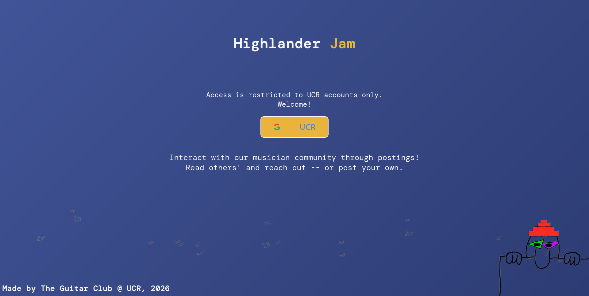
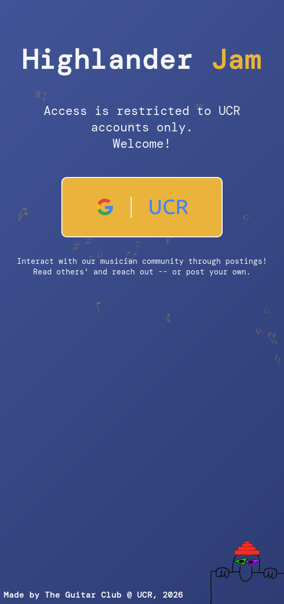
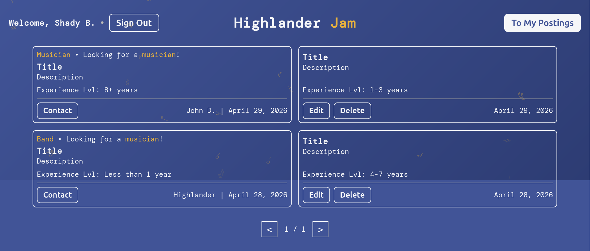
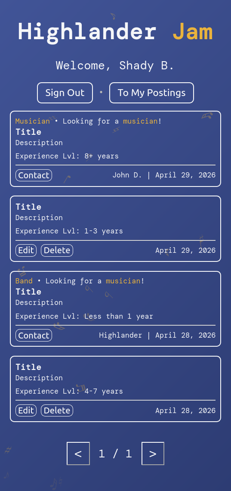
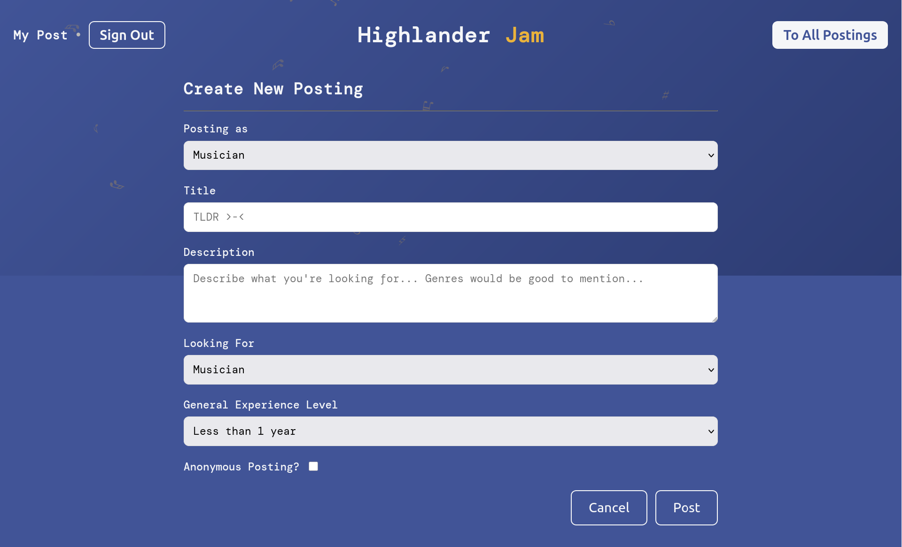
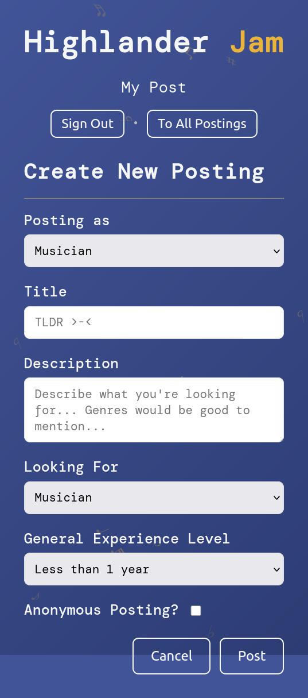
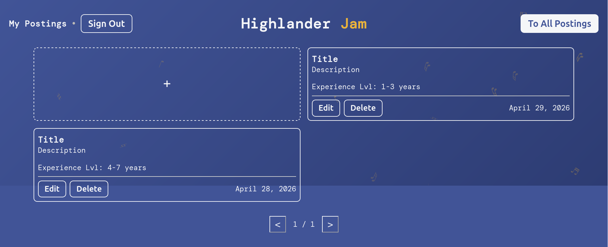
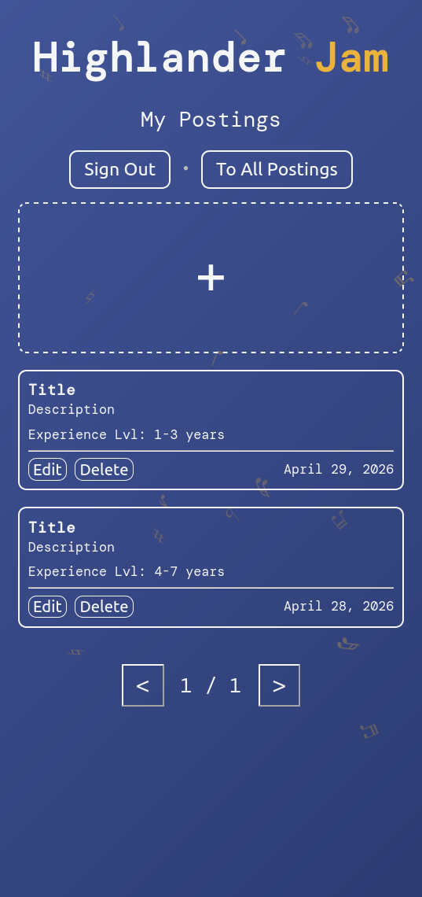
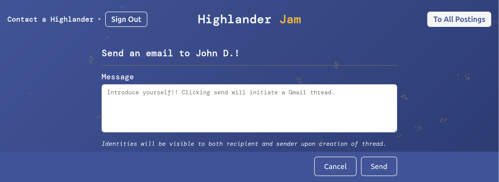
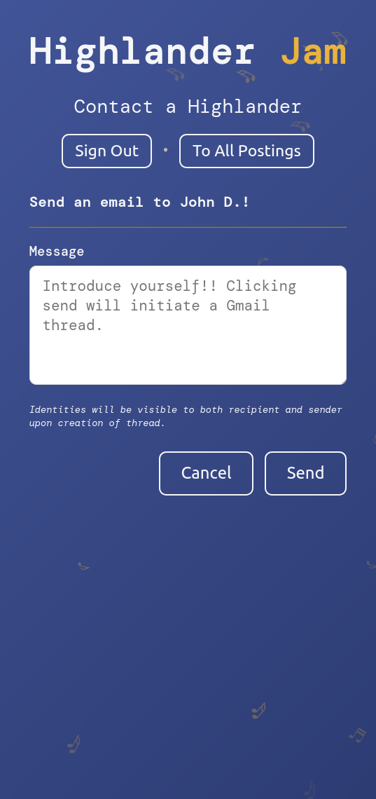

# Highlander Jam

A minimalist community posterboard for UCR musicians to connect and collaborate together.

**Highlander Jam** is a web application designed for the UCR Guitar Club to bring musicians together. Whether you're looking for bandmates, jam session partners, or want to showcase your musical talent, Highlander Jam makes it easy to connect with fellow musicians in the UCR community.

## Features

- **User Authentication**: Secure Google OAuth login restricted to UCR accounts (@ucr.edu)
- **Create Postings**: Post as a musician or band, specifying what you're looking for (musicians, bands, or jam sessions)
- **Browse Community**: Discover other musicians and bands in the UCR community with paginated browsing
- **My Profile**: View and manage all your postings in one place
- **Contact Musicians**: Reach out to other musicians through the in-app messaging system
- **Responsive Design**: Works seamlessly on desktop and mobile devices
- **Animated Background**: Interactive visual experience while browsing the platform

## Screenshots

### Login Page
| Desktop | Mobile |
|---------|--------|
|  |  |

### Browse Postings
| Desktop | Mobile |
|---------|--------|
|  |  |

### Create Posting
| Desktop | Mobile |
|---------|--------|
|  |  |

### My Postings
| Desktop | Mobile |
|---------|--------|
|  |  |

### Contact Page
| Desktop | Mobile |
|---------|--------|
|  |  |

## Project Structure

```
HighlanderJam/
├── index.html              # Login page
├── postings.html           # Browse all community postings
├── profile.html            # View and manage your postings
├── submit.html             # Create new posting form
├── contact.html            # Contact form for messaging musicians
├── 404.html                # Error page
│
├── css/
│   ├── styles.css          # Global styles
│   ├── login.css           # Login page styles
│   ├── submit.css          # Posting form styles
│   ├── profile.css         # Profile page styles
│   ├── pagination.css      # Pagination controls
│   ├── contact.css         # Contact form styles
│   └── background.css      # Animated background
│
├── js/
│   ├── firebase.js         # Firebase initialization & config
│   ├── login.js            # Authentication logic
│   ├── postings.js         # Postings display & pagination
│   ├── submit.js           # Form submission logic
│   ├── profile.js          # Profile management
│   ├── contact.js          # Contact form handling
│   ├── pagination.js       # Pagination functionality
│   ├── postcard.js         # Individual posting card component
│   ├── topbar.js           # Navigation bar
│   ├── background.js       # Background animation
│   ├── signout.js          # Logout functionality
│   ├── load.js             # Page initialization
│   ├── loadModule.js       # Navigation utilities
│   └── utils.js            # Helper functions
│
├── docs/
│   └── screenshots/        # README screenshots (desktop & mobile)
│       ├── login-desktop.png
│       ├── login-mobile.png
│       ├── postings-desktop.png
│       ├── postings-mobile.png
│       ├── submit-desktop.png
│       ├── submit-mobile.png
│       ├── mypostings-desktop.png
│       ├── mypostings-mobile.png
│       ├── contact-desktop.png
│       └── contact-mobile.png
│
├── resources/ (for easter egg)
│   ├── images/             # Image assets
│   └── sounds/             # Audio assets
│
└── firebase.json           # Firebase hosting configuration
```

## Getting Started

### Prerequisites

- A UCR email account (@ucr.edu)
- Modern web browser (Chrome, Firefox, Safari, Edge)
- Internet connection

### Running Locally

1. **Clone the repository**
   ```bash
   git clone https://github.com/ShadyBarrios/HighlanderJam.git
   cd HighlanderJam
   ```

2. **Open in browser**
   ```
   # Open index.html in your browser or use a local server (live server works too!)
   ```

## Key Features Explained

### Authentication
- Secure Google OAuth login with UCR domain restriction
- User data stored in Firestore with display names and email
- Automatic redirect to postings page after login

### Postings System
- **Post Type**: Choose to post as "Musician" or "Band"
- **Looking For**: Specify what you're searching for (Musician, Band, or Jam Session)
- **Experience Level**: Indicate your general experience level
- **Details**: Add title and description to help others understand your music style and goals

### Browsing & Discovery
- View all community postings with 6 posts per page
- View your own postings in the "My Postings" section
- Contact musicians directly through the messaging system

## Technology Stack

- **Frontend**: HTML5, CSS3, JavaScript (ES6+)
- **Backend**: Firebase
  - Authentication: Google Sign-In
  - Database: Firestore
  - Hosting: Firebase Hosting
- **Libraries**: Google Identity Services, Firebase SDK (v10.0.0)
- **Fonts**: DM Mono, Noto Music (Google Fonts)

## Firebase Configuration

The app uses Firebase for backend services. Configuration is in [js/firebase.js](js/firebase.js):
- Project ID: `highlander-jam`
- Auth Domain: `highlander-jam.firebaseapp.com`
- Database: Firestore (Cloud Firestore)

**Security Note**: The Firebase API keys are exposed in client-side code, but this is safe because Firebase is configured with security rules and domain restrictions. The keys are restricted to the `highlander-jam.firebaseapp.com` domain, preventing unauthorized use from other domains.

## Page Guide

| Page | Purpose |
|------|---------|
| `index.html` | Login portal (entry point) |
| `postings.html` | View all community postings |
| `profile.html` | Manage your own postings |
| `submit.html` | Create new postings |
| `contact.html` | Message other musicians |


## Contributing

We welcome contributions from the UCR community! Whether you're fixing bugs, adding features, or improving documentation, here's how you can help.

### Getting Started

1. **Fork the repository** on GitHub
2. **Clone your fork** locally:
   ```bash
   git clone https://github.com/YOUR-USERNAME/HighlanderJam.git
   cd HighlanderJam
   ```
3. **Create a new branch** for your feature or fix:
   ```bash
   git checkout -b feature/your-feature-name
   # or
   git checkout -b fix/bug-description
   ```

### Development Guidelines

- **Code Style**: Follow consistent formatting with the existing codebase
- **Comments**: Add comments for complex logic or non-obvious functionality
- **Testing**: Test your changes across different browsers and devices
- **Responsive Design**: Ensure changes work on both desktop and mobile

### Making Changes

1. **HTML**: Keep markup semantic and accessible
2. **CSS**: Follow the existing style structure; add new styles to appropriate CSS files
3. **JavaScript**: Use ES6+ syntax; modularize code with imports/exports where applicable
4. **Firebase**: Don't commit sensitive credentials; use environment variables

### Submitting Changes

1. **Commit your changes** with clear, descriptive messages:
   ```bash
   git commit -m "Add feature: description of what you added"
   git commit -m "Fix: description of bug you fixed"
   ```
2. **Push to your fork**:
   ```bash
   git push origin your-branch-name
   ```
3. **Open a Pull Request** on the main repository with:
   - Clear title describing the change
   - Description of what was changed and why
   - Any relevant issue numbers

### Reporting Issues

Found a bug? Have a feature idea? Please open an issue on GitHub with:
- Clear description of the problem or suggestion
- Steps to reproduce (for bugs)
- Expected vs actual behavior
- Screenshots or error messages if applicable

### Code of Conduct

- Be respectful and inclusive
- Provide constructive feedback
- Help fellow contributors
- Focus on making HighlanderJam better for the UCR community

## Easter Egg

Shady was here! Click him...

## Credits

Init'd by Scott Gonzalez Barrios, 2026

Made and maintained by The Guitar Club @ UCR

GitHub copilot carried this readme lol.